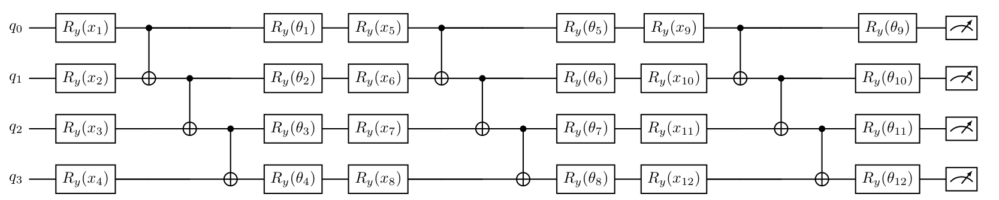

# DRU-VQC: Data Reuploading Variational Quantum Circuit for IoT Intrusion Detection

[](https://python.org)
[](https://pennylane.ai)
[](https://qiskit.org)
[](LICENSE)

A quantum machine learning framework for IoT network intrusion detection that bypasses the physical qubit bottleneck via **layered data reuploading** — achieving **95.5% accuracy** on the CIC IoT 2023 dataset using only **4 qubits**.

---

## Overview

Standard QML approaches compress high-dimensional network traffic data using PCA before loading it onto a quantum circuit. This destroys threat information — retaining only ~56% of original variance — and cripples classification accuracy.

This project proposes **DRU-VQC**, which uploads 12 Mutual Information-ranked features *sequentially across three circuit layers* on a 4-qubit register, bypassing PCA entirely. SHAP explainability is integrated to provide auditable feature attribution for security analysts.

| Model | Accuracy | F1 | Recall |
|---|---|---|---|
| Ablation VQC (PCA + Variational) | 67.5% | 0.778 | 0.851 |
| **Proposed DRU-VQC (MI + Reuploading)** | **95.5%** | **0.967** | **0.993** |

The 28 percentage point gap between the Ablation VQC and DRU-VQC directly quantifies the cost of PCA compression.

---

## Architecture



Each block: **Ry encoding → cascading CNOT entanglement → trainable Ry variational layer**. Output is the tensor product Pauli-Z expectation passed through a sigmoid for binary classification.
---

## Repository Structure

```
├── root.py                  # Data ingestion, cleaning, train/test split
├── ranking.py               # Mutual Information feature ranking
├── pca.py                   # PCA compression (used by baselines)
├── dru_vqc.py               # Proposed DRU-VQC model (train + evaluate)
├── dru_shap.py              # SHAP explainability for DRU-VQC
├── ablation_vqc.py          # Ablation VQC (PCA + variational, control group)
├── qsvm.py                  # Quantum kernel SVM baseline
├── clsbaseline.py           # Classical baselines (SVC, RandomForest)
├── noisy_eval_dru_vqc.py    # Noisy hardware evaluation via Qiskit Aer
├── visualize_results.py     # Plots and comparison tables
├── dataset/                 # Raw CIC IoT 2023 CSV shards
├── outputs/                 # Generated artifacts (models, metrics, plots)
└── requirements.txt
```

---

## Setup

```bash
git clone https://github.com/your-username/dru-vqc.git
cd dru-vqc
pip install -r requirements.txt
```

> **Note:** `qiskit-aer-gpu` requires compatible GPU drivers. The noisy evaluation script falls back to CPU Aer automatically if unavailable.

---

## Running the Pipeline

Execute scripts in order — each step produces outputs consumed by the next.

```bash
# 1. Prepare dataset (requires dataset/ shards)
python root.py

# 2. Rank features by Mutual Information
python ranking.py

# 3. Generate PCA features (for baselines)
python pca.py

# 4. Train and evaluate all models
python dru_vqc.py
python ablation_vqc.py
python qsvm.py
python clsbaseline.py

# 5. SHAP explainability
python dru_shap.py

# 6. Noisy hardware simulation
python noisy_eval_dru_vqc.py

# 7. Generate comparison plots
python visualize_results.py
```

All outputs (metrics CSVs, model weights, plots) are written to `outputs/`.

---

## Key Results

**SHAP Feature Attribution** — The quantum circuit independently learned that `Tot sum` and `Magnitude` (total payload volumetrics) are the dominant attack indicators, consistent with DDoS and Mirai botnet behavior. `flow_duration` and `urg_count` had minimal impact, validating that the MI batching strategy directed the circuit toward genuine threat signals.

**Noisy Hardware** — Evaluation via `noisy_eval_dru_vqc.py` using Qiskit Aer's `GenericBackendV2` noise model provides estimated performance under realistic NISQ device conditions (2048 shots).

---

## Dependencies

| Package | Role |
|---|---|
| `pennylane` | Quantum circuit simulation and training |
| `pennylane-qiskit` | PennyLane–Qiskit backend bridge |
| `qiskit` / `qiskit-aer` | Noisy hardware simulation |
| `scikit-learn` | Classical baselines, PCA, SVM |
| `shap` | Feature attribution |
| `numpy`, `pandas` | Data processing |
